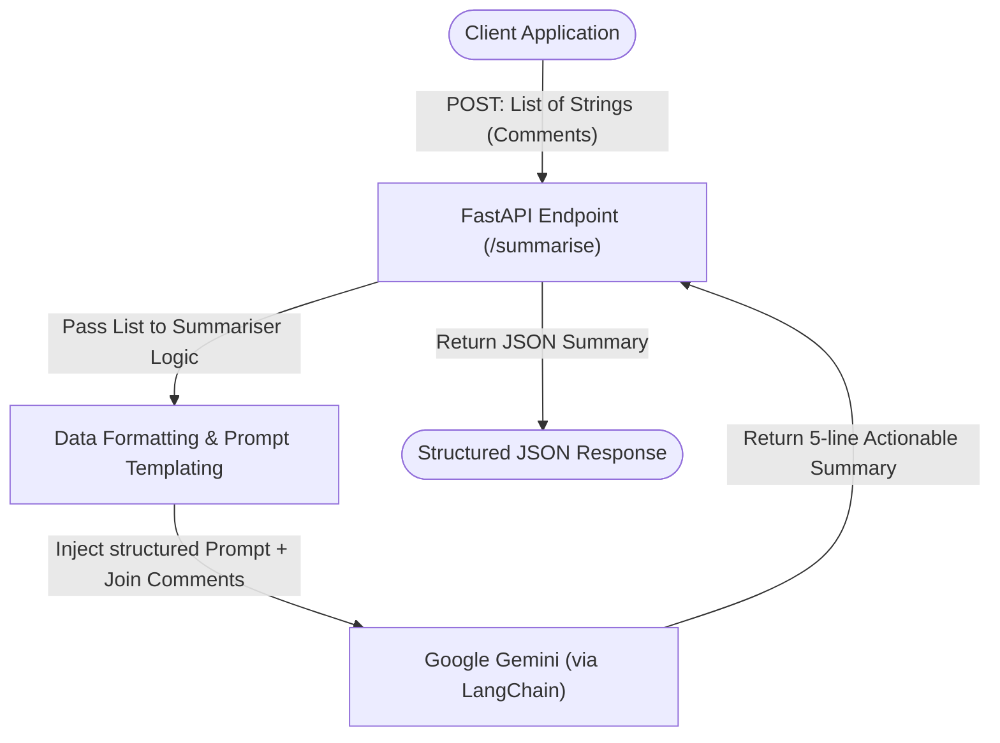

# Comment Summariser API

The Comment Summariser API is an AI-powered service designed to read a list of technical support ticket comments, consolidate the information, and provide a clear, structured summary. It leverages Google's Gemini Flash Language Model via LangChain to extract the core problem, steps tried, status, and the next course of action.

Built with **FastAPI**, **LangChain**, and **Google Gemini**, this application is quick to deploy and simple to use.

## 🌟 Key Features
- **Intelligent Summarisation:** Automatically structures messy back-and-forth ticket comments.
- **Structured Output:** Enforces a rigid structure: Problem, Steps Tried, Current Status, and Next Action.
- **RESTful API:** Easily integratable via a robust FastAPI endpoint.
- **High Performance:** Uses Gemini 2.5 Flash for high speed and accuracy.

## 🏗️ Architecture Flowchart
The following flowchart illustrates the step-by-step approach the application takes to fulfill a client request:



## 🧠 Comment Summarisation Approach
When a list of comments is supplied to the `/summarise` endpoint, the following sequence occurs:

1. **Validation & Ingestion:** FastAPI's Pydantic model (`SummariseRequest`) validates the incoming JSON body to ensure it contains a `comments` array of strings.
2. **Preprocessing:** The raw list of strings is enumerated and joined into a single coherent block of text, keeping the chronical order in context (e.g. `Comment 1: ... \n Comment 2: ...`).
3. **Prompt Construction:** A `PromptTemplate` instructs the LLM with its persona ("You are a technical support engineer") and rigidly lays out the output format constraints (Max 5 lines, 4 specific points).
4. **LLM Invocation:** LangChain creates a pipeline routing the prompt into `ChatGoogleGenerativeAI` with a low temperature (`0.2`) to maintain determinism and factual accuracy without hallucinations.
5. **Response Delivery:** The model's response is packaged into a descriptive dictionary containing the total number of comments ingested and the final text summary, which is correctly returned as a JSON object to the client application.

## 🚀 Quick Start

### 1. Requirements
- Python 3.10+
- Google Gemini API Key

### 2. Installation
Ensure you have the virtual environment activated, then install dependencies:
```bash
python -m venv .venv
.venv\Scripts\activate
pip install -r requirements.txt
```

### 3. Environment Setup
Create a `.env` file in the root directory and add your Gemini Key:
```env
GEMINI_API_KEY=your_gemini_api_key_here
```

### 4. Running the App
Start the FastAPI server:
```bash
python main.py
```
The server will be available at `http://localhost:8000`. You can visit `http://localhost:8000/docs` to see the interactive Swagger UI and test your endpoint directly.

## 💻 Tech Stack
- **Web App Framework:** [FastAPI](https://fastapi.tiangolo.com/)
- **AI Agent Orchestration:** [LangChain](https://python.langchain.com/)
- **LLM Engine:** [Google Gemini 2.5 Flash API](https://ai.google.dev/)